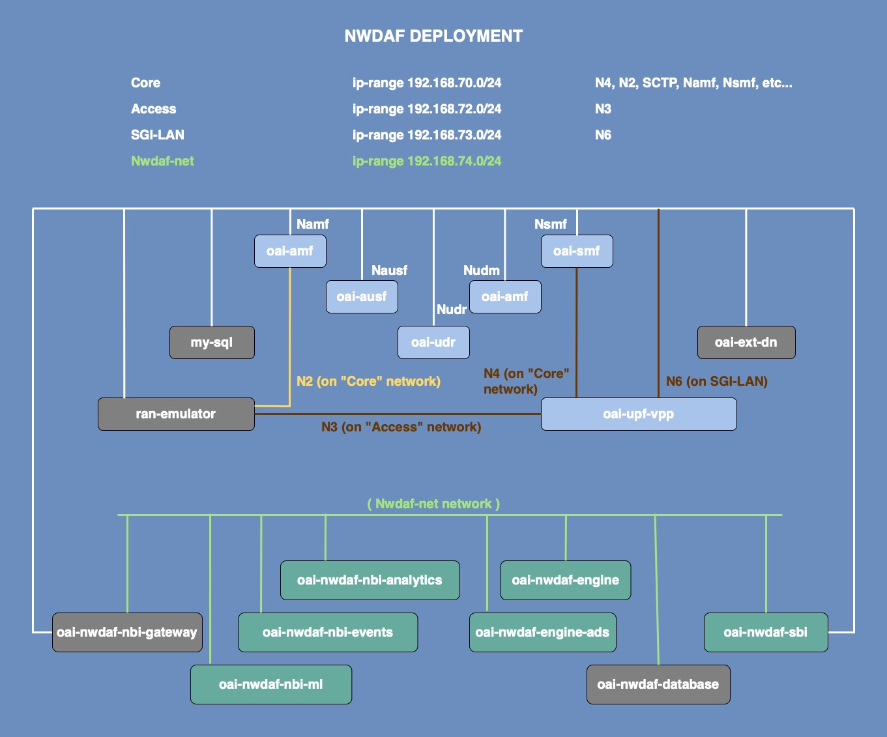

<table style="border-collapse: collapse; border: none;">
  <tr style="border-collapse: collapse; border: none;">
    <td style="border-collapse: collapse; border: none;">
      <a href="http://www.openairinterface.org/">
         
         </img>
      </a>
    </td>
    <td style="border-collapse: collapse; border: none; vertical-align: center;">
      <b><font size = "5">OpenAirInterface implementation of the 5G Network Data Analytics Function</font></b>
    </td>
  </tr>
</table>

NWDAF contains:

- NWDAF Analytics Info Service API [**NBI Analytics**]
- NWDAF Events Subscription Service API [**NBI Events**]
- NWDAF ML Model Provision Service API [**NBI Ml**]
- NWDAF Engine [**Engine**]
- NWDAF Engine ADS [**Engine ADS**]
- NWDAF Southbound Interface [**SBI**]

Its primary objective is to offer comprehensive documentation and tutorials guiding users through the process of deploying NWDAF using container-based technology.

## 1. Building NWDAF images

### Clone the repository

```bash
git clone https://gitlab.eurecom.fr/oai/cn5g/oai-cn5g-nwdaf.git
cd oai-cn5g-nwdaf
# to use the latest release
git checkout master
# to use the latest development sprint result
git checkout develop
```

Note: use `--no-cache` flag during rebuilds for optimal results.

All images but `oai-nwdaf-engine-ads` have a target base with `alpine`. They can be run on any operating system.

As for `oai-nwdaf-engine-ads`, it has a `python:3.6.9-slim` target base (which is `Debian:10`-based). It should be able to run on any operating system as well.

### 1.1. oai-nwdaf-nbi-analytics

```bash
docker build --network=host --no-cache  \
            --target oai-nwdaf-nbi-analytics  --tag oai-nwdaf-nbi-analytics:latest \
            --file components/oai-nwdaf-nbi-analytics/docker/Dockerfile.nbi-analytics \
            components/oai-nwdaf-nbi-analytics
```

### 1.2. oai-nwdaf-nbi-events

```bash
docker build --network=host --no-cache  \
            --target oai-nwdaf-nbi-events  --tag oai-nwdaf-nbi-events:latest \
            --file components/oai-nwdaf-nbi-events/docker/Dockerfile.nbi-events \
            components/oai-nwdaf-nbi-events
```

### 1.3. oai-nwdaf-nbi-ml

```bash
docker build --network=host --no-cache  \
            --target oai-nwdaf-nbi-ml  --tag oai-nwdaf-nbi-ml:latest \
            --file components/oai-nwdaf-nbi-ml/docker/Dockerfile.nbi-ml \
            components/oai-nwdaf-nbi-ml
```

### 1.4. oai-nwdaf-engine

```bash
docker build --network=host --no-cache  \
            --target oai-nwdaf-engine  --tag oai-nwdaf-engine:latest \
            --file components/oai-nwdaf-engine/docker/Dockerfile.engine \
            components/oai-nwdaf-engine
```

### 1.5. oai-nwdaf-engine-ads

```bash
docker build --network=host --no-cache  \
            --target oai-nwdaf-engine-ads  --tag oai-nwdaf-engine-ads:latest \
            --file components/oai-nwdaf-engine-ads/docker/Dockerfile.engine-ads \
            components/oai-nwdaf-engine-ads
```


### 1.6. oai-nwdaf-sbi

```bash
docker build --network=host --no-cache  \
            --target oai-nwdaf-sbi  --tag oai-nwdaf-sbi:latest \
            --file components/oai-nwdaf-sbi/docker/Dockerfile.sbi \
            components/oai-nwdaf-sbi
```

### 1.7. Pull required images

```bash
docker pull mongo 
docker pull kong
```

### Remove dangling images

```bash
docker image prune --force
```

Later versions of docker are using the `BUILD_TOOLKIT`:

```bash
docker buildx prune -f
```

## 2. Network configuration

Ensure a secure and functional network setup using the following steps:

```bash
sudo sysctl net.ipv4.conf.all.forwarding=1
sudo iptables -P FORWARD ACCEPT
echo "127.1.0.1   oai-nwdaf-nbi-gateway" | sudo tee -a /etc/hosts
```

## 3. NWDAF deployment



### 3.1. Starting 5G CN

For this deployment, we utilized OAI CN v2.0.0 release. If you require the NWDAF UE_Mobility event, it's recommended to use the `develop` branch, which does support location notifications.

```bash
# Navigate out of the oai-nwdaf project repository
cd ..

# Clone the repository directly from the v2.0.0 release tag
git clone --branch v2.0.0 https://gitlab.eurecom.fr/oai/cn5g/oai-cn5g-fed.git
```

To deploy the OAI 5G Core Network, execute the following commands:

```bash
# Make sure you are in the oai-cn5g-fed/docker-compose project repository
cd oai-cn5g-fed/docker-compose

# You can deploy 5G CN only with NRF (scenario 1) and HTTP/2.
python3 ./core-network.py --type start-basic-vpp --scenario 1
```

**Warning -** If you stop the 5G CN, specifically AMF and SMF, while NWDAF is still running, the subscriptions to the network functions will be lost. Ensure to restart NWDAF every time you restart 5G CN to maintain correct behavior.

### 3.2. Starting NWDAF

To initiate NWDAF components, execute the following commands:

```bash
# Navigate back to the oai-nwdaf project repository
cd ../../oai-cn5g-nwdaf
```

```bash
# Deploying NWDAF if AMF/SMF HTTP version is 1 (if you have modified the OAI CN5G from default)
docker-compose -f docker-compose/docker-compose-nwdaf-cn-http1.yaml up -d --force-recreate
```
```bash
# Deploying NWDAF if AMF/SMF HTTP version is 2
docker-compose -f docker-compose/docker-compose-nwdaf-cn-http2.yaml up -d --force-recreate
```

## 4. Testing

After ensuring both the 5G CN and NWDAF are up and running, you can conduct various tests to validate NWDAF features. Here's how you can perform the tests:

### 4.1. Attaching gnbsim

Ensure you have the `gnbsim` image by pulling a prebuilt Docker image

```bash
docker pull rohankharade/gnbsim
docker image tag rohankharade/gnbsim:latest gnbsim:latest
```

Attach a UE using the gnbsim-vpp:

```bash
# Navigate to the oai-cn5g-fed project repository
cd ../oai-cn5g-fed

# Attach a UE using the gnbsim-vpp scenario
docker-compose -f docker-compose/docker-compose-gnbsim-vpp.yaml up -d --force-recreate
```

### 4.2. Testing NWDAF features

We have implemented the following features for both the Events Subscription API and the Analytics Info API:

- Event: NETWORK_PERFORMANCE
   - Type: Number of connected users (NwPerType: NUM_OF_UE)
   - Type: Session success ratio (NwPerType: SESS_SUCC_RATIO)
- Event: UE_COMMUNICATION
- Event: UE_MOBILITY

In addition to these features, we have also implemented an ML-based feature exclusively for the Events Subscription API:

- Event: ABNORMAL_BEHAVIOUR
  - Exception ID: UNEXPECTED_LARGE_RATE_FLOW

#### 4.2.1 Test Analytics Info API

Run the `CLI` to test the Events Subscription API:

```bash
# Navigate to cli directory
cd ../oai-cn5g-nwdaf/cli

# Create and activate a virtual environment
python3 -m venv env
source env/bin/activate

# Install dependencies
python -m pip install --upgrade pip
pip install -r requirements.txt

# Run the nwdaf CLI to test Analytics Info API
python nwdaf.py analytics examples/analytics/<json_file_name>
```

#### 4.2.2 Test Event Subscription API

Run the `CLI` to test the Events Subscription API:

```bash
# Run the nwdaf CLI to test Events Subscription API
python nwdaf.py subscribe examples/subscriptions/<json-file-name>
```

#### 4.2.3 3GPP APIs

For more in-depth information about 3GPP APIs, refer to the following specifications:

- Events Subscription ([editor](https://forge.3gpp.org/swagger/editor-versions/v3.18.0/?url=https://forge.3gpp.org/rep/all/5G_APIs/raw/REL-17/TS29520_Nnwdaf_EventsSubscription.yaml))([UI](https://forge.3gpp.org/swagger/ui/?url=https://forge.3gpp.org/rep/all/5G_APIs/raw/REL-17/TS29520_Nnwdaf_EventsSubscription.yaml))
- Analytics Info ([editor](https://forge.3gpp.org/swagger/editor-versions/v3.18.0/?url=https://forge.3gpp.org/rep/all/5G_APIs/raw/REL-17/TS29520_Nnwdaf_AnalyticsInfo.yaml))([UI](https://forge.3gpp.org/swagger/ui/?url=https://forge.3gpp.org/rep/all/5G_APIs/raw/REL-17/TS29520_Nnwdaf_AnalyticsInfo.yaml))
- Data Management ([editor](https://forge.3gpp.org/swagger/editor-versions/v3.18.0/?url=https://forge.3gpp.org/rep/all/5G_APIs/raw/REL-17/TS29520_Nnwdaf_DataManagement.yaml))([UI](https://forge.3gpp.org/swagger/ui/?url=https://forge.3gpp.org/rep/all/5G_APIs/raw/REL-17/TS29520_Nnwdaf_DataManagement.yaml))
- MLModel Provision ([editor](https://forge.3gpp.org/swagger/editor-versions/v3.18.0/?url=https://forge.3gpp.org/rep/all/5G_APIs/raw/REL-17/TS29520_Nnwdaf_MLModelProvision.yaml))([UI](https://forge.3gpp.org/swagger/ui/?url=https://forge.3gpp.org/rep/all/5G_APIs/raw/REL-17/TS29520_Nnwdaf_MLModelProvision.yaml))

### 4.3. Inspecting oai-nwdaf-database

To examine the data stored in the `oai-nwdaf-database`:

```bash
# Open MongoDB console in the container
docker exec -it oai-nwdaf-database mongosh

# Switch to testing database
use testing

# View data in amf or smf collections
db.amf.find()
db.smf.find()
```

## 5. Stopping NWDAF deployment

To stop `NWDAF`, run:
```bash
# Make sure you are in the oai-nwdaf project repository
cd ../../oai-cn5g-nwdaf

# Stop NWDAF if AMF/SMF HTTP version is 1 
docker-compose -f docker-compose/docker-compose-nwdaf-cn-http1.yaml down
```
```bash
# Stop NWDAF if AMF/SMF HTTP version is 2 
docker-compose -f docker-compose/docker-compose-nwdaf-cn-http2.yaml down
```

To stop the `gnbsim-vpp`, run:

```bash
# Make sure you are in the oai-cn5g-fed project repository
cd ../oai-cn5g-fed

# Stop UE
docker-compose -f docker-compose/docker-compose-gnbsim-vpp.yaml down
```

To stop the `OAI CN`, run:

```bash
# Make sure you are in the oai-cn5g-fed/docker-compose project repository
cd docker-compose

# Stop CN
python3 ./core-network.py --type stop-basic-vpp --scenario 1
```


# 6. Support/further resources

- [Original OAI-NWDAF paper IEEE GLOBECOM 2023](https://www.eurecom.fr/publication/7410/download/comsys-publi-7410.pdf)
- [Demo](https://lnkd.in/e-b2jaHk)
